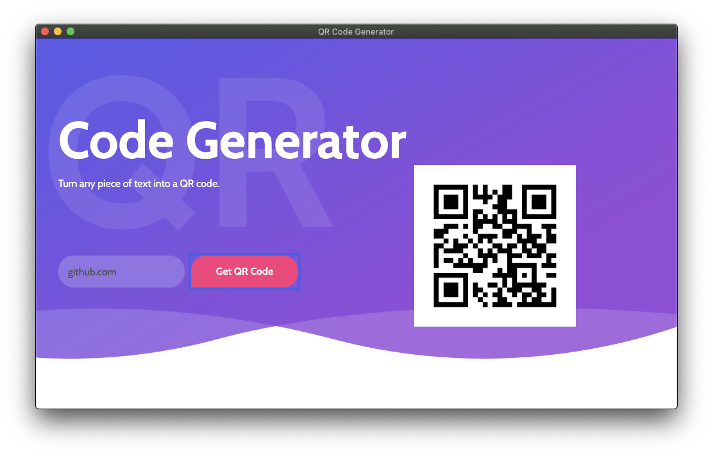

# getting-started-with-eel

Watch the video here: https://youtu.be/iy2aKf9AAvc

The simplest and fastest way to create applications with a Web UI and a Python backend.



## Getting Started
- Clone the repo and cd into the directory
```sh
$ git clone git@github.com:SouravJohar/getting-started-with-eel.git
$ cd getting-started-with-eel
```

- Install eel, pyqrcode, and pyinstaller

```sh
$ pip install eel pyqrcode pyinstaller pypng
```

- Run the app

```sh
$ python QRCode.py
```

## Packaging the app
You can pass any valid `pyinstaller` flag in the following command to further customize the way your app is built.
```sh
$ python -m eel QRCode.py web --noconsole --onefile --icon=barcode.icns
```
